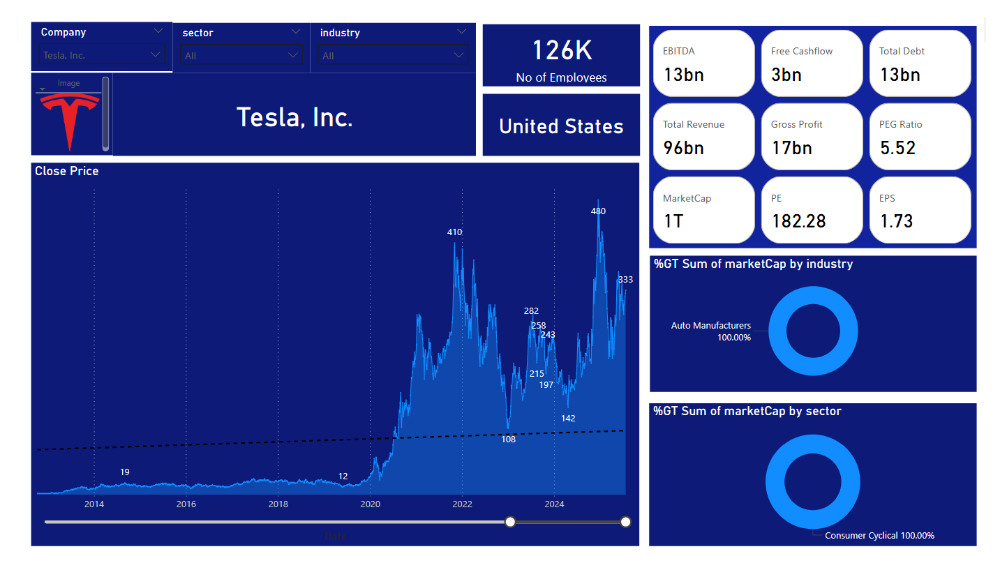

# Stock Automation
## Project Details

This repository automates US stock data for S&P 500 stocks and can be used for PowerBI Visualisation

### Contents

1. **data/raw/Tickers_Codes.csv**  
   CSV File which contains all Tickers from S&P 500.

2. **scripts/Main_Stock.py**  
   Functions of this file:
   This file reads the tickers from `Tickers_Codes.csv` and downloads the **Stock Info** for each ticker.
   It also retrieves key financial indicators including:
     - Market Capitalisation (`marketCap`)
     - Price-to-Earnings Ratios (`trailingPE`, `forwardPE`)
     - Volatility (`beta`)
     - Earnings per Share (`trailingEps`)
     - Industry (`industry`)
     - Sector (sector)
     - Number of Full-Time Employees (`fullTimeEmployees`)
     - Country (`country`)
     - EBITDA (`ebitda`)
     - Total Debt (`totalDebt`)
     - Total Revenue (`totalRevenue`)
     - Gross Profits (`grossProfits`)
     - Free Cash Flow (`freeCashflow`)
     - Company Name (`shortName`)
     - PEG Ratio (`trailingPegRatio`) 
   - Saves this data into two separate files:
     - `Stock_Info.csv` → financial fundamentals.

3. **scripts/HistoricalStocks_gspread.py**
   This file reads `Tickers_Codes.csv` from Github and generates the csv file in your Google Drive.  
   Contains the **last 10 years of daily Close Price data** for all tickers in `Tickers_Codes.csv`, should be used via using Google Service account and folder in Drive with all credentials etc.

### Other files
4. **scripts/Historical_Stocks.py**
   This file reads `Tickers_Codes.csv` [saved in the Google drive of your folder] and generated a csv file containing the **last 10 years of daily Close Price data** for all tickers in `Tickers_Codes.csv`, [Can be used for manual refresh in some Google Folder, but not suitable for Github Actions as the files downloaded are >100MB].

6. **data/raw/Countries with Flags URL.csv**
   Contains Flags of all countries with URL. Used for PowerBI

7. **data/raw/Tickers Info.xlsx**  
   An Excel file with table of S&P 500 components from Wikipedia, including:
   - Ticker symbol
   - Company name
   - Sector

8. **data/processed/Stock_Info.csv**
   These files are generated after execution of `Main_Stocks.py`.
   `Stocks_Info.csv` contains information about the ticker.
   `Main_Actual_Stock.csv` contains information about the ClosePrice of the tickers.

This project utilises **GitHub Actions** for automatic every day updates at 9:30 PM (IST) or 4:00 PM (UTC).  
The scheduled workflow performs the following steps:

- Checks the repository
- Configures the Python environment
- Installs dependencies (`yfinance`, `pandas`,`gspread`,`oauth2client`)
- Executes the `Main_Stocks.py` and `HistoricalStocks_gspread.py` script
- Commits and pushes the updated data to the repository or Google Drive
- Create PowerBI Dashboards etc
